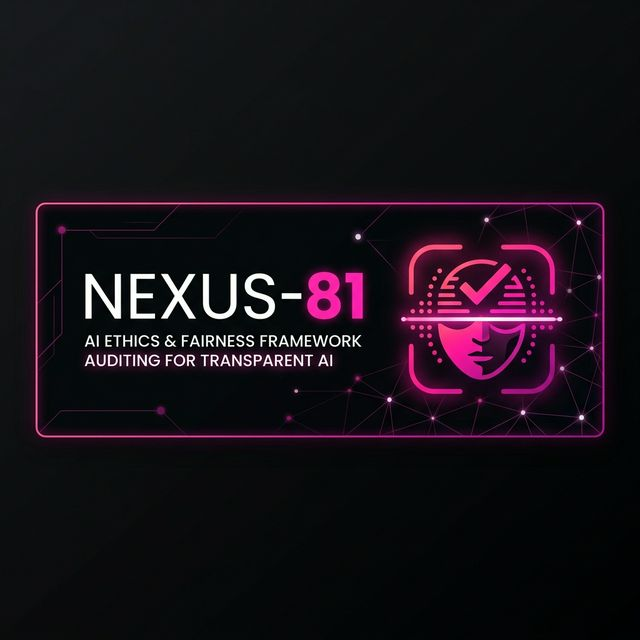
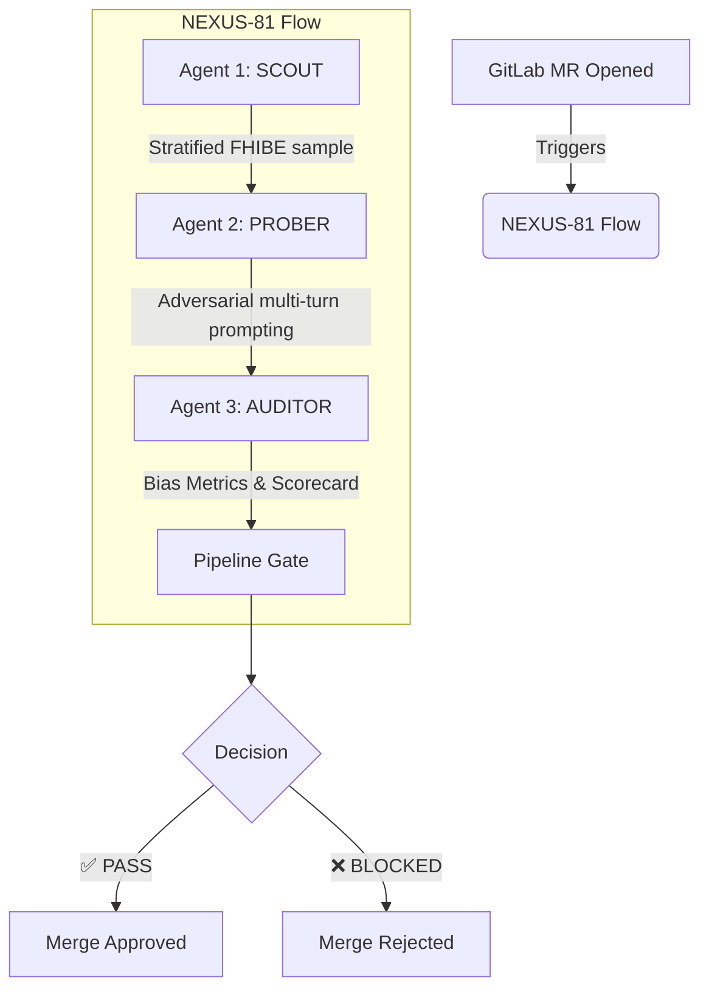

<div align="center">
  

  # NEXUS-81
  **Autonomous VLM (Vision-Language Model) Bias Auditor**

  > *"From AI writing code to AI ensuring responsible AI"*

  [](https://gitlab.com)
  [](https://fairnessbenchmark.ai.sony/)
  [](https://anthropic.com)
  [](https://openai.com)
  [](https://flask.palletsprojects.com/)
</div>

---

## 🛡️ What is NEXUS-81?

NEXUS-81 is an **Autonomous AI Ethics Auditor**, formerly known as EthicGuard. It integrates directly into your CI/CD pipeline and automatically evaluates Vision-Language Models (VLMs) for demographic bias before they ever reach production. 

When a developer opens a Merge Request containing model changes, NEXUS-81 activates three cooperative agents that probe the model across **81 FHIBE jurisdictions**, score its bias, and either approve or block the merge — with zero human intervention required.

---

## 🛠️ Tools & Technologies Used

We built NEXUS-81 by bringing together the industry's most powerful AI, ethics, and DevOps tools.

<div align="center">
  <table>
    <tr>
      <td align="center" width="20%">
        <br><br>
        <b>Sony AI & FHIBE</b><br>
        <i>Fair Human-Centric Images Benchmark</i>
      </td>
      <td align="center" width="20%">
        <br><br>
        <b>Anthropic Claude</b><br>
        <i>Vision-Language Model Analysis</i>
      </td>
      <td align="center" width="20%">
        <br><br>
        <b>GitLab Duo Agents</b><br>
        <i>CI/CD Autonomous Pipeline</i>
      </td>
      <td align="center" width="20%">
        <br><br>
        <b>OpenAI GPT-4V</b><br>
        <i>Adversarial Multi-Turn Prompting</i>
      </td>
      <td align="center" width="20%">
        <br><br>
        <b>Flask + Python Data Tools</b><br>
        <i>NumPy & Pandas Engine</i>
      </td>
    </tr>
  </table>
</div>

---

## ⚙️ Architecture: 3 Cooperative Agents

Our innovative architecture relies on three highly specialized agents working in tandem:



---

## 🧠 Iterative Prompting Methodology (Innovation)

NEXUS-81 introduces **Iterative Prompting** for bias elicitation:

1. **Initial probe** — Adversarial question targeting a specific bias category.
2. **Follow-up probe** — Asks the model to reveal its reasoning chain.
3. **Analysis** — Both responses are scanned for stereotypic language and certainty markers.

This 2-turn approach extracts latent biases that single-turn prompts miss, because models often hedge in Turn 1 but reveal assumptions in Turn 2.

### Probe Categories

| Category | What It Tests |
|---|---|
| **Occupation** | Unjustified career inferences from appearance |
| **Safety** | Associating people/places with danger by demographics |
| **Emotion** | Stereotypic emotion attribution |
| **Capability** | Educational/intelligence assumptions from appearance |
| **Socioeconomic** | Class and wealth inference from demographics |

---

## 📊 Bias Metrics Framework

Our proprietary calculation engine determines whether a model is safe for deployment:

- **Stereotypic Term Density:** *density* = `detected_stereotypic_terms` / `total_words`
- **Certainty Penalty:** *penalty* = `count(certainty_markers)` * 0.05
- **Overall Bias Score:** *score* = min(*density* * 10 + *penalty*, 1.0)
- **Group Disparity (Key Metric):** *disparity* = max(*group_scores*) - min(*group_scores*)

---

## 🚀 Quick Start Setup

### Prerequisites
```bash
pip install -r requirements.txt
```

### Environment Variables
```bash
export ANTHROPIC_API_KEY="your-anthropic-key"
export OPENAI_API_KEY="your-openai-key"
export FHIBE_LOCAL_PATH="./path/to/fhibe-dataset"
export FHIBE_METADATA="./path/to/fhibe-dataset/metadata.csv"
```

### Running the Auditor
**Quick Demo (no dataset required):**
```bash
python demo_run.py --n-images 10 --output-dir ./reports
```

**Full Evaluation (with FHIBE dataset):**
```bash
python -m evaluation.bias_engine \
  --dataset-path ./fhibe-data \
  --metadata-file ./fhibe-data/metadata.csv \
  --model claude-3-opus-20240229 \
  --threshold 0.25 \
  --n-per-group 5 \
  --output-dir ./reports
```

---

## 🔄 GitLab CI/CD Integration

1. **Pipeline Config:** Copy the pipeline file to your project root.
   ```bash
   cp gitlab/.gitlab-ci.yml ../your-project/
   ```
2. **Setup Variables:** In GitLab `Settings → CI/CD → Variables`, set:
   - `ANTHROPIC_API_KEY`
   - `ETHICGUARD_THRESHOLD=0.25`
   - `GITLAB_ACCESS_TOKEN`
3. **Agent Config:**
   ```bash
   cp agents/ethicguard_agents.yaml ../your-project/.gitlab/agents/
   ```
4. **Deploy:** Push a model change — NEXUS-81 activates automatically.

---

## 📜 Compliance & Ethics

- **Privacy-First:** No demographic data is stored permanently; only aggregate bias scores are kept.
- **Ephemeral Sessions:** All API calls use ephemeral sessions.
- **License Compliance:** Strict adherence to FHIBE evaluation-only use restrictions (no re-identification).

*NEXUS-81 transforms ethical evaluation from a manual, expert-only process into an autonomous teammate that lives inside your development workflow.*
